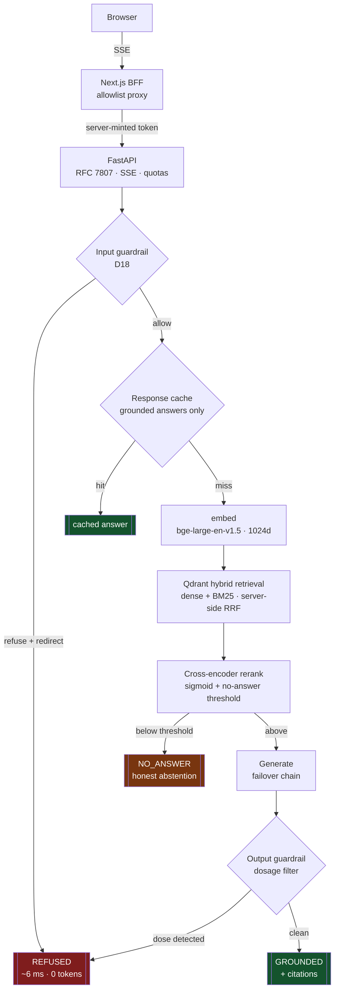
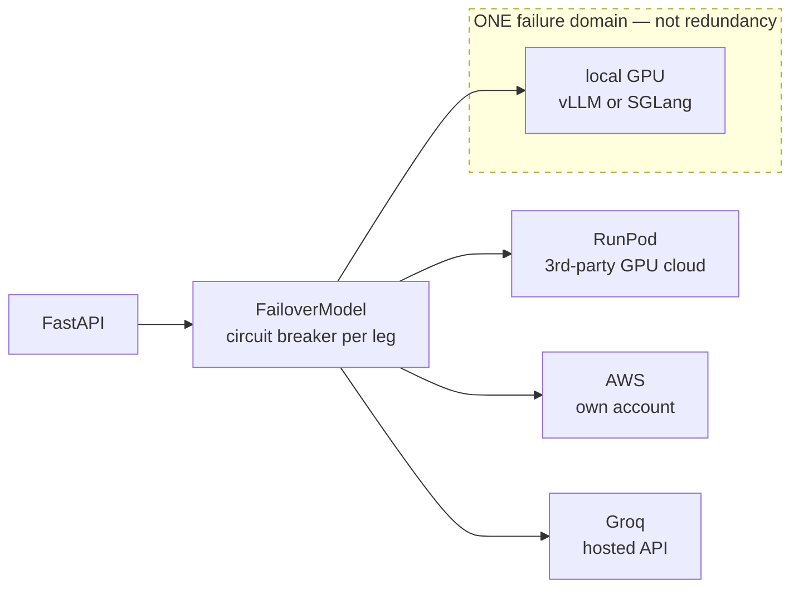
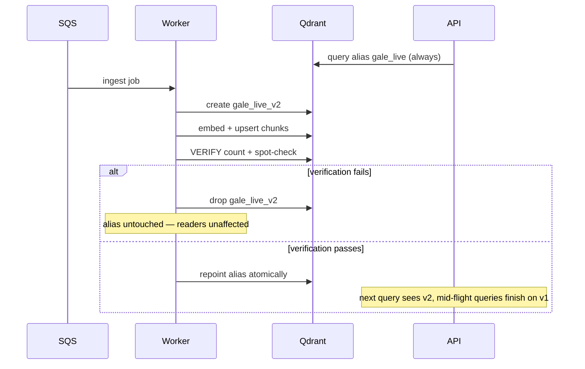
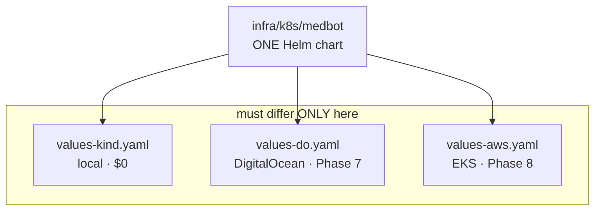
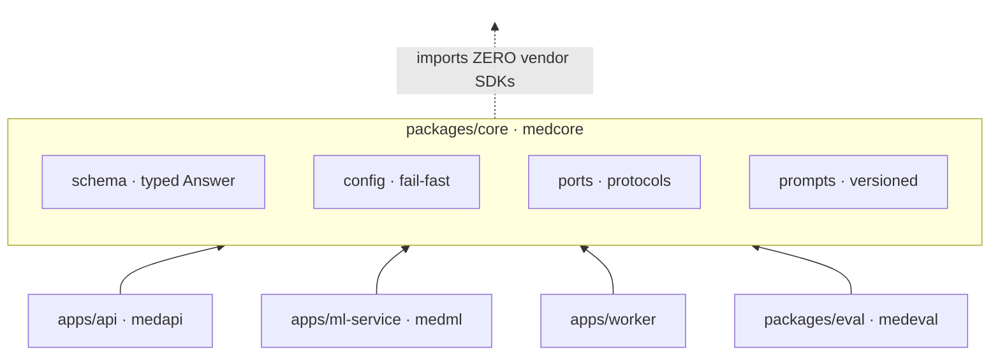

# Architecture

Diagrams are Mermaid so they live in git and change in the same commit as the code. A PNG
would be stale within a week and nobody would know.

## 1. Request path

The ordering is the design. Everything cheap and deterministic happens before anything
expensive or probabilistic.

**Why the guardrail is first.** It is a rule engine, not a model — so there is nothing to
prompt-inject, it costs no GPU and no tokens, and a refusal returns in ~6 ms. Putting safety
after retrieval would make it depend on retrieval *failing*, which is exactly the accident
that measured `refusal_correctness` at 0.50 in S6.

**Why the output guardrail exists too.** Defence in depth: S10.2b found the input rules can
pass a question whose *answer* still contains a dosing schedule. It runs on both the
buffered and the streaming path — it originally ran only on the buffered one, which is not
the path the browser uses.

## 2. Failure domains

The failover chain is ordered by **independent failure domain**, which is what makes it real
outage protection.

`SERVING_ENGINE` selects vLLM **or** SGLang *within* a GPU venue. SGLang is deliberately not
its own chain entry: two engines on one GPU die together, so chaining them would sell
redundancy that does not exist (D12 v2.1). A test enforces it.

Every leg speaks the same OpenAI-compatible protocol, so one adapter serves all four and a
venue with no URL is skipped rather than erroring — configuration and provisioning proceed
independently. Measured failover: **2438 ms → 93 ms** once the breaker trips.

## 3. Ingestion — never a half-built index

Readers never see a partially-ingested corpus, and a bad ingest is a no-op rather than an
outage. Rollback is repointing the alias back — measured at **3.5 s**, against **390×**
longer to rebuild from source.

## 4. Deployment — one chart, three targets

The portability claim is falsifiable on purpose: if moving vendors requires a change outside
`values-<vendor>.yaml` and `infra/terraform/<vendor>/`, the claim failed. Phase 8 exists to
test it rather than to assert it.

## 5. Package boundaries

`medcore` defines `EmbedderPort`, `VectorStorePort`, `RerankerPort`, `ModelPort` as protocols
and imports no vendor SDK. Qdrant, sentence-transformers and the LLM clients live behind
adapters in `apps/api/src/medapi/adapters/`, so swapping any one of them touches a single
file — and the eval harness can run the pipeline in-process against the same contracts.

## Key invariants

| Invariant | Enforced by |
|---|---|
| A grounded answer cannot exist without a citation | typed `Answer` refuses construction |
| Only grounded answers are cacheable | `Answer.is_cacheable` |
| Cache invalidation is version-key composition, never manual purge | `Settings.cache_namespace` |
| Nothing outside `medcore.config` reads `os.environ` | lint + review |
| Redis or Postgres loss degrades, never fails, the service | readiness excludes them deliberately |
| A dose in the output is a safety failure regardless of wording | output guardrail + scorer veto |
